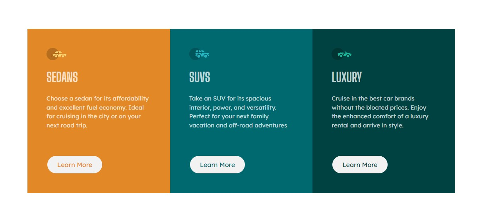

# Frontend Mentor - NFT preview card component solution

This is a solution to the [NFT preview card component challenge on Frontend Mentor](https://www.frontendmentor.io/challenges/nft-preview-card-component-SbdUL_w0U). Frontend Mentor challenges help you improve your coding skills by building realistic projects. 

## Table of contents

- [Overview](#overview)
  - [The challenge](#the-challenge)
  - [Screenshot](#screenshot)
- [Links](#links)
- [Built with](#built-with)
- [Continued development](#continued-development)
- [Author](#author)
- [Acknowledgments](#acknowledgments)


### The challenge

Users should be able to:

- View the optimal layout depending on their device's screen size
- See hover states for interactive elements

### Screenshot



### Links

- Live Site URL: [Add live site URL here](https://your-live-site-url.com)

### Built with

- Semantic HTML5 markup
- CSS custom properties
- Bootstrap v5.0

To see how you can add code snippets, see below:

```html
  <div class="container">
    <div class="row">
      <div class="col-md-4 sedan">
        <div class="card">
          
          <div class="card-body p-5">
            
            <h2 class="card-title my-4">Sedans</h2>
            <p class="card-text">Choose a sedan for its affordability and excellent fuel economy. Ideal for cruising in the city or on your next road trip.</p>
            <a href="#" class="btn btn-primary rounded-pill mt-5">Learn More</a>
          </div>
        </div>
      </div>
      <div class="col-md-4 suvs">
        <div class="card">
          
          <div class="card-body p-5">
            
            <h2 class="card-title my-4">SUVs</h2>
            <p class="card-text">Take an SUV for its spacious interior, power, and versatility. Perfect for your next family vacation and off-road adventures</p>
            <a href="#" class="btn btn-primary rounded-pill mt-5">Learn More</a>
          </div>
        </div>
      </div>
      <div class="col-md-4 luxury">
        <div class="card">
          <div class="card-body p-5">
            
            <h2 class="card-title my-4">Luxury</h2>
            <p class="card-text">Cruise in the best car brands without the bloated prices. Enjoy the enhanced comfort of a luxury rental and arrive in style.</p>
            <a href="#" class="btn btn-primary rounded-pill mt-5">Learn More</a>
          </div>
        </div>
      </div>
    </div>
  </div>
```
```css
    body{
      display: grid;
      place-items: center;
      height: 100vh;
       font-family: 'Lexend Deca', sans-serif; 
      font-size: 15px;
    }
    .card{    
      border: none;
      border-radius: 0px;
      height: 100%;
      color: hsla(0, 0%, 100%, 0.75);
    }
    img.card-img-top{width: 50px;}
    .row{margin:15px;}
    .col-md-4{padding:0px;}
    .sedan .card{ background-color: hsl(31, 77%, 52%); border-top-left-radius: 10px; border-top-right-radius: 10px; }
    .card-title{text-transform: uppercase; font-family: 'Big Shoulders Display', cursive;}
    .suvs .card{ background-color: hsl(184, 100%, 22%);}
    .luxury .card{ background-color: hsl(179, 100%, 13%); border-bottom-left-radius: 10px; border-bottom-right-radius: 10px;}
    .sedan .rounded-pill{ color:hsl(31, 77%, 52%); border-color: hsl(31, 77%, 52%);}
    .suvs .rounded-pill{color:hsl(184, 100%, 22%); border-color: hsl(184, 100%, 22%);}
    .luxury .rounded-pill{color:hsl(179, 100%, 13%); border-color: hsl(179, 100%, 13%);;}
    .rounded-pill{ padding: 10px 25px; background-color: hsl(0, 0%, 95%); box-sizing: border-box; border-width: 2px;}
    .attribution { font-size: 11px; text-align: center; }
    .attribution a { color: hsl(228, 45%, 44%); }
    .rounded-pill:hover{border-color: hsl(0, 0%, 95%); color: hsl(0, 0%, 95%); border-width: 2px;;}
    .sedan .rounded-pill:hover{background-color:hsl(31, 77%, 52%);}
    .suvs .rounded-pill:hover{background-color:hsl(184, 100%, 22%);}
    .luxury .rounded-pill:hover{background-color:hsl(179, 100%, 13%);}

    @media (min-width:768px) {
      .attribution{position:absolute; bottom: 0px;}
      .sedan .card{ background-color: hsl(31, 77%, 52%); border-top-left-radius: 10px; border-top-right-radius: 0px; border-bottom-left-radius: 10px; }
      .luxury .card{ background-color: hsl(179, 100%, 13%); border-bottom-left-radius: 0px; border-bottom-right-radius: 10px; border-top-right-radius: 10px;}
    }
    @media (min-width:1200px) {
      .col-md-4{width: 28.333333%;}
      .row{ justify-content: center;}
    }
```

### Continued development

Bootstrap is one of the framework I am wanting to become well verse in. It helps development pages really quickly. I totally recommend it if you have a deadline with your project.

## Author

- Website - [Xulab](https://substeven.netlify.app/)
- Frontend Mentor - [@Xulab05](https://www.frontendmentor.io/profile/Xulab5)
- Twitter - [@Xulab05](https://www.instagram.com/xulab05/)

## Acknowledgments
I'd like to give thanks to Front-end for this awesome short project.
